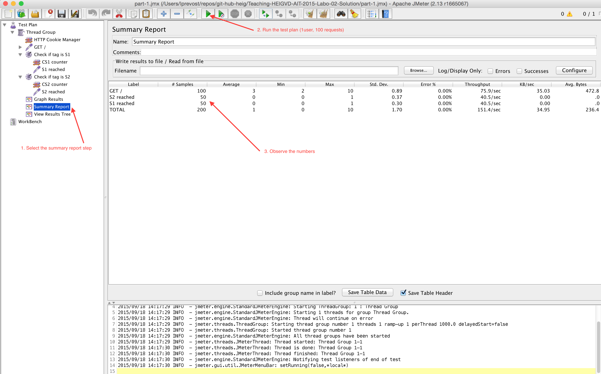

title: Lab 03 - Load balancing
---

## Lab 03 - Load balancing


#### Pedagogical objectives

* Deploy a web application in a two-tier architecture for scalability

* Use a load balancer

* Performance-test a load-balanced web application

In this lab you will perform a number of tasks and document your
progress in a lab report. Each task specifies one or more deliverables
to be produced.  Collect all the deliverables in your lab report. Give
the lab report a structure that mimics the structure of this document.

### Task 1: Install the tools

In this part you will install the base tools you need to do the different
tasks and to answers the questions.

Install the following tools:

* [Vagrant](https://www.vagrantup.com/)
* [JMeter](http://jmeter.apache.org/)

Clone the following repository on your machine

[https://github.com/SoftEng-HEIGVD/Teaching-HEIGVD-AIT-2015-Labo-02](https://github.com/SoftEng-HEIGVD/Teaching-HEIGVD-AIT-2015-Labo-02)

Once it is done, do the start the VM from the project folder with the following command.

```bash
# Start for the first time the VM with a default provisioned state. The VM will build and start HAProxy container, two
# webapp nodes called S1 and S2.
$> vagrant up

# Connect to the VM via SSH
$> vagrant ssh

# List the running containers
$> docker ps

# This is the result you should expect
CONTAINER ID        IMAGE                  COMMAND             CREATED             STATUS              PORTS                                                                NAMES
2b277f0fe8da        softengheigvd/ha       "./run.sh"          21 seconds ago      Up 20 seconds       0.0.0.0:80->80/tcp, 0.0.0.0:1936->1936/tcp, 0.0.0.0:9999->9999/tcp   ha
0c7d8ff6562f        softengheigvd/webapp   "./run.sh"          22 seconds ago      Up 21 seconds       3000/tcp                                                             s2
d9a4aa8da49d        softengheigvd/webapp   "./run.sh"          22 seconds ago      Up 21 seconds       3000/tcp                                                             s1

# The webapps expose the TCP port 3000. This is where NodeJS Application is listening for request.
# The HAProxy is listening on TCP ports 80, 1936 and 9999. We will come back later for ports > 80. The 80 is the listening port
# where the traffic is balanced.
```

In fact, we reached the goal to have the following architecture.


Now you can open the `http://192.168.42.42` in your favorite browser. You will receive this JSON payload.

```json
{
  "hello": "world!",
  "ip": "172.17.0.7",
  "host": "2b277f0fe8da",
  "tag": "s1",
  "sessionViews": 1,
  "id": "pdoSpuStaotzO4us2l_uYArG0w6S57eV"
}
```

The `ip` correspond to the internal container IP. This will help to identify. The `host` is the hostname of the container
and in our context this represent the container ID. The `tag` represent the server tag corresponding, in our case, to
the container name (docker **--name s1**). The `sessionViews` is the number of times you have requested the REST 
resource. **Hint**: It will be a good indicator of the session behavior. Finally, the `id` is the session id in the 
NodeJS application.

Ok, now it's time to play a bit with what we did until now.

Open JMeter and then open the script `tester.jmx` present in the root folder of the project and follow the instructions 
present in the following screenshot.




**Deliverables:**

* Explain what is the behavior when you open and refresh the URL `http://192.168.42.42` in any browser. Add screenshots
  to emphasis your explanations. We expect that you take a deeper a look on the session management.
  
* Explain what should be a real correct behavior in the session management.

* Provide a sequence diagram to explain what is happening when we call for the first time the URL and then we refresh
  the page. We want to see what is happening about the cookie. We want to see the sequence between the browser and
  HAProxy and we want to see also the sequence between HAProxy and the S1 and S2 nodes. There is an example:
  
  

* Provide the summary report screenshot from JMeter

* In the Vagrant VM, run the following command:

  ```bash
  $> docker stop s1
  ```
  
  Clear the results in JMeter and redo a run. Explain what is happening when only one node remains active. Provide
  another diagram sequence in the same model from the previous one.


### Task 2: Sticky session

It's time to go further. At this stage, we know have a load balanced web application but the session management is
totally messed. We want you to fix the configuration by enabling th sticky session management.

For that, you will have to play with docker a little bit more. So, here we go we some useful commands and hints. **All
the following commands are run inside the Vagrant VM (`vagrant ssh` to enter in the VM).**

#### How to build a web application container (it should not be necessary in this lab)

```bash
# If you are in the directory of the webapp
$> docker build -t webapp .

# If you are in a different directory from the webapp
$> docker build -t webapp <pathToWebAppDirectory>
```

The `-t webapp` will tag the image with the name `webapp` and then in the next commands you will be able to use that image name.

#### How to start a web application container

**Hint**: The image is already built in this lab once you provisioned the Vagrant VM. The name of the image is: `softengheigvd/webapp`

```bash
$> docker run -d -e "TAG=<containerName>" --name <containerName> softengheigvd/webapp
```

* **containerName**: Use a human container name like we did in this lab. We chosen `s1` and `s2`.

**Remark**: If you have built your own version of the web app image, replace the image name by yours.

**Remark 2**: If an error message is saying `s1` or `s2` is already used, it means that a container was already started. Then, you should clear the containers

#### How to remove a web application container

```bash
# If not stated
$> docker rm s1

# If started
$> docker rm -f s1
```

#### How to start a container in interactive mode

```bash
$> docker run -ti -p 80:80 -p 1936:1936 -p 9999:9999 --link <webappContainerName1> --link <webappContainerName2> --name ha <imageName> bash
```

In this example, we have few placeholders to fill

* **webappContainerName** 1 and 2: Replace by the names you have given to the containers (see below). Should be `s1` and `s2`. This will create the required network and env vars plumbing for later use.
* **containerName**: We used `ha` for the container name.
* **imageName**: We used `softengheigvd/ha` for the image name. You will have to rebuild frequently the image or to use it extensively in interactive mode.

**Remark**: Remember that all the modifications done in the container are only persisted in the container. Once the container is erased, no data will survive and then all the modifications are lost.

To avoid loosing data, add the following argument when you launch the HAProxy:

```bash
$> docker run -ti ... -v /vagrant/ha/config:/config --name ha <imageName> ... bash
```

Now, you have prepared a volume that will share the haproxy.cfg between your host, the Vagrant VM and the running container. Then, if you do a modification in this file on your host, or in the VM or
in the container, the modification will be seen in the three places and will persist in the time.

#### How to start HAProxy when running the container in interactive mode

##### Automatic method

Simply run the `/scripts/run-daemon.sh` script. The script will take care to update the container IPs of `s1` and `s2`.

```bash
/scripts/run-daemon.sh
```

### Manual method

**Warning**: The first time you will run manually, you should start the `rsyslogd` daemon to be able to get logs in files.

```bash
rsyslogd
```

Before running the HAProxy process, you need to update the configuration to enable the `s1` and `s2` web applications for the balancing.

Update in the container the file `/config/haproxy.cfg` find and replace the following lines:

```bash
# Around lines 30s
    server s1 <s1>:3000 check
    server s2 <s2>:3000 check
```

If you have used `--link s1` and `--link s2` when you started the 

Replace `<s1>` with the container IP of `s1`, same for `<s2>`. To get the IP of each container, apply the following method. You will get the IP directly. You cannot
run this command inside the HAProxy container. You should do it in the Vagrant VM and then copy/paste the IP in the right place.

```bash
$> docker inspect --format '{{ .NetworkSettings.IPAddress }}' <containerName>

* **containerName**: The web application container name.
```

Finally, you can run the following command to start or restart the HAProxy

```bash
haproxy -D -f /usr/local/etc/haproxy/haproxy.cfg -p /var/run/haproxy.pid
```

#### How to consult the logs

Once you are in interactive mode with the HAProxy container, you have to run the following command:

```bash
$> tail -f /logs/haproxy.log
```

If you want to have access from you host in the logs or in the Vagrant VM, you have to add the following argument to the docker command to run the HAProxy container in interactive mode.

```
$> docker run ... -v /vagrant/ha/logs:/logs --name ha <imageName> ... bash
```

Now, you will have access, at least, in the Vagrant VM to `/vagrant/ha/logs/haproxy.log` file and you can do a `tail -f`.

#### How to remove a HAProxy container

```bash
# If not started
$> docker rm ha

# If started
£> docker rm -f ha
```

**Deliverables:**

* Provide the `haproxy.cfg` with the modifications you did to enable the sticky session with a short explanation of 
  modifications done.

* Explain what is the behavior when you open and refresh the URL `http://192.168.42.42` in any browser. Add screenshots
  to emphasis your explanations. We expect that you take a deeper a look on the session management.
  
* Provide a sequence diagram to explain what is happening when we call for the first time the URL and then we refresh
  the page. We want to see what is happening about the cookie. We want to see the sequence between the browser and
  HAProxy and we want to see also the sequence between HAProxy and the S1 and S2 nodes. We also want to see what is
  happening when a second browser is used.

* Provide the summary report screenshot from JMeter. Is there a difference with this run and the run of Task 1 ?

* Clear the results in JMeter.

* Now, update the JMeter script. Go in the HTTP Cookie Manager and uncheck the box `Clear cookies each iteration?`

* Provide the summary report screenshot from JMeter. This time, is there a difference with this run and the run of Task 1 ?

* Once again, update the JMeter script. Go in `Thread Group` and update the `Number of threads`. Set the value to 2. 

* Provide the summary report screenshot from JMeter. Give a short explanation on what is happening for the balancing.

### Task 3: Drain mode

HAProxy provides a mode where we can set a node in DRAIN. In fact, HAProxy will let current sessions continuing to make requests
on the node in DRAIN mode and redirecting all other traffic on the other nodes.

In our case, it will mean that if we put `s1` in DRAIN mode, all new traffic will reach the `s2` node and all current traffic 
directed to `s1` will continue to communicate with `s1`.

There is also the MAINT mode which is more intrusive than DRAIN. In this mode, all current and new traffic is redirected on the
other active nodes even if there is active sessions.

In this task, we will experiment these two modes. We will base our next steps on the work done on Task 2. We expect you have
a working Sticky Session configuration with two web app nodes up and running called `s1` and `s2`.

When all the infra is up and running, we will:

1. Open a browser on your host

2. Go to `http://192.168.42.42` and reach one of the two nodes. Let's assume it is `s1` but in your case, it could be `s2` as it is roundrobin for the balancing strategy.

3. Refresh the page, you should get the same result expect the views counter is incremented.

4. Refresh multiple times the page and see that you continue to query the same node and see the views counter is increased.

5. In a different tab, open `http://192.168.42.42:1936` and take a look. You should have something similar to the following screenshot.


  You must be able to view the `s1` and `s2` nodes and their state.
  
For the next operations, you will need to use `socat` which is a command line tool to connect pretty much anything with anything. The
tool is already installed in the Vagrant VM and therefore you do not need any additional installation on your host.

To use it, connect to Vagrant VM via ssh (`vagrant ssh`) and then use the following.

```bash
# This command will let you the possibility to enter text. Then, you have to enter "prompt" to enter HAProxy command line console.
$> socat - tcp:localhost:9999
prompt
```

Then, what you will enter are commands that will be directly interpreted by HAProxy. First, increase the client timeout to avoid
loosing connexion. 

```bash
> set timeout cli 1d
```

Now, to set a state to a node `ready`, `maint` or `drain`, enter the following command.

```bash
> set server nodes/<containerName> state <state>
```

**Remark**: In fact, the `nodes` is the group of backend nodes labelled. You will find the corresponding `backend nodes` in ha config.

**Remark 2**: The containerName is the label of the node. In fact, in this labo, we used the same name as Docker container names but both names are not linked together. We can 
choose different names if we want. The name set in this command is the name present in the HAProxy admin stats interface (or also found in the config file).

**Remark 3**: We will use only the three states presented there. Take care that the command only accept lower cases states.

**Deliverables:**

* Take a screenshot of the Step 5 and tell us which node is answering.

* Based on your previous answer, set the node in DRAIN mode. Take a screenshot of the HAProxy state page.

* Refresh your browser and explain what is happening. Tell us if you stay on the same node or not. If yes, why? If no, why?

* Open another browser and open `http://192.168.42.42`. What is happening?

* Clear the cookies on the new browser and repeat these two steps multiple times. What is happening? Are you reaching the node in DRAIN mode?

* Reset the node in READY mode. Repeat the three previous steps and explain what is happening? Provide HAProxy stats page screenshot.

* Finally, set the node in MAINT mode. Redo the three same steps and explain what is happening? Provide HAProxy stats page screenshot.

### Task 4: Balancing strategies

In this forth part of the lab, you will discover the different strategies of HAProxy to load balance the traffic between the nodes.

You can discover the different strategies in [HAProxy documentation](http://cbonte.github.io/haproxy-dconv/configuration-1.6.html#balance)

To help viewing the difference between strategies, the web application has a REST resource to configure a delay in the response. You
can set an arbitrary delay in milliseconds. Once the delay is configured, the response will take the amount of time configured.
 
To set the timeout, you have to do a `POST` request with the following content (be sure the `Content-Type` header is set to `application/json`. The 
configuration is applicable on each node. Therefore, you can do one `POST` request on `http://192.168.42.42/delay` and taking a look to the response cookies
will tell you which node has been configured.

```json
{
  "delay": 1000
}

The previous example will set a delay of 1 second.

Or from the Vagrant VM, retrieve the IP of the container you want to configure and then do the `curl` command to configure the delay.

```bash
$> docker inspect --format '{{ .NetworkSettings.IPAddress }}' <containerName>

$> curl -H "Content-Type: application/json" -X POST -d '{"delay": 1000}' http://<containerIp>:3000/delay
```

To reset the delay configuration, just do a `POST` with 0 as the delay value.

Prepare your JMeter script with cookies erased (this will simulate new clients for each requests) and 10 threads this will
simulate 10 concurrent users.

*Remark*: In general, take a screenshot of the summary report in JMeter to explain what is happening.

**Deliverables:**

* Based on the previous step, run the JMeter script to have the base data set to compare with the other strategies. Take
a screenshot of the summary report.

* Set a delay of 2500 milliseconds on `s1`. Relaunch a run with the JMeter script and explain what it is happening?

* Set a delay of 250 milliseconds on `s1`. Same than previous step.

* In the two previous steps, are there any error? Why?

* Update the HAProxy configuration to add a weight to your nodes. For that, add `weight [1-256]` where the value of weight is
between the two values (inclusive). Set `s1` to 2 and `s2` to 1. Redo the three first steps.

* Now, change your HAProxy configuration file to remove the weight (for the moment) and change the balancing strategy. Use the
`first` strategy. Reset the web apps to have no delay. Clear the JMeter results.

* Do a JMeter run and explain what is happening.

* Set a delay of 250 milliseconds on `s1` and redo the JMeter run. Explain what is happening.

* Once again, reset the JMeter results and make sure your configuration file is ready to change for the `leastconn` strategy.

* Do a new JMeter run with this strategy and explain what is happening. Is there another strategy that looks similar? If yes, which one?

* Set the delay to `s1` at 250 milliseconds and redo a JMeter run. What do you observe?

* Redo all the previous step but configure JMeter to not clear the cookies between each iterations. Compare:
  
  * `roundrobin` with/without cookies erased
  * `first` with/without cookies erased
  * `leastconn` with/without cookies erased
  
* Make a general comparison, in your own opinion, about the three strategies used there. Read the documentation to understand the differences.

* Finally, for the purpose of this lab, which is the best strategy for the case where both web application are 100% up and ready?

#### References

* [HAProxy Socket commands (drain, ready, ...)](https://cbonte.github.io/haproxy-dconv/configuration-1.5.html#9.2-set%20server)
* [Socat util to run socket commands](http://www.dest-unreach.org/socat/)
* [Socat command examples](https://stuff.mit.edu/afs/sipb/machine/penguin-lust/src/socat-1.7.1.2/EXAMPLES)

#### Lab due date

Deliver your results at the latest TBD.
